# Missing Components Analysis

## 📋 Comprehensive List of Missing Components

### 🗄️ Database Components

#### Missing Methods (CRITICAL)
```javascript
// lib/database.js - Already identified in PHASE_1_CRITICAL.md
✅ approveFetchedEmail(id)
✅ removeFetchedEmail(id)
✅ addMultipleFetchedEmails(emails)
✅ updateReviewEmail(id, data)
✅ approveReviewEmail(id)
✅ getProcessedEmails()
✅ updateProcessedEmail(id, updates)
✅ deleteProcessedEmail(id)
✅ getRecycleBin()
✅ restoreFromRecycleBin(id)
✅ permanentlyDeleteFromRecycleBin(id)

// Additional missing methods needed for full functionality:
❌ createAuditLog(auditData)
❌ getAuditLogs(filters)
❌ bulkApproveEmails(emailIds)
❌ bulkDeclineEmails(emailIds)
❌ bulkProcessEmails(emailIds)
❌ getEmailsByDateRange(startDate, endDate)
❌ searchEmails(query, filters)
❌ getEmailStats(userId, dateRange)
❌ createBackup()
❌ restoreFromBackup(backupFile)
```

#### Missing Database Files
```bash
# In data/ directory:
✅ emails.json (exists in schema)
✅ users.json (exists in schema)  
✅ extractedData.json (exists in schema)
✅ attachments.json (exists in schema)
✅ notifications.json (exists in schema)
✅ settings.json (exists in schema)
❌ audit.json (not initialized)
❌ recycleBin.json (not used properly)
```

### 🖥️ Backend Components

#### Missing Middleware
```javascript
// server.js missing middleware:
❌ Session timeout middleware
❌ CSRF protection middleware
❌ Rate limiting middleware
❌ Input validation middleware
❌ Audit logging middleware
❌ Error handling middleware
❌ File upload middleware (for imports)
❌ Security headers middleware
```

#### Missing Routes
```javascript
// server.js missing API endpoints:
❌ GET /api/notifications - Get user notifications
❌ POST /api/notifications/mark-read - Mark notifications as read
❌ DELETE /api/notifications/:id - Delete notification
❌ GET /api/notifications/stream - Server-sent events for real-time
❌ POST /api/emails/bulk-approve - Bulk approve emails
❌ POST /api/emails/bulk-decline - Bulk decline emails
❌ GET /api/search - Advanced email search
❌ POST /api/import - Import data from file
❌ GET /api/export/csv - CSV export
❌ GET /api/backup - Create backup
❌ POST /api/restore - Restore from backup
❌ GET /api/audit - Get audit logs
❌ PUT /api/settings/notifications - Update notification preferences
```

#### Missing Services
```javascript
// lib/ directory missing services:
❌ lib/security.js - Security utilities (CSRF, validation)
❌ lib/notifications.js - Real-time notification system
❌ lib/audit.js - Audit logging system
❌ lib/backup.js - Backup and restore functionality
❌ lib/import.js - Data import handling
❌ lib/search.js - Advanced search functionality
❌ lib/cache.js - Caching for AI categorization
❌ lib/quota.js - Gmail API quota management
```

### 🎨 Frontend Components

#### Missing CSS Files
```css
/* public/css/ directory needs: */
❌ styles.css - Main stylesheet (basic version created in Phase 1)
❌ components.css - Component-specific styles
❌ themes.css - Dark teal theme variables
❌ responsive.css - Mobile-first responsive design
❌ animations.css - UI animations and transitions
❌ print.css - Print styles for exports
```

#### Missing JavaScript Files
```javascript
// public/js/ directory needs:
❌ app.js - Main application logic (basic version created in Phase 1)
❌ auth.js - Authentication management
❌ workflow.js - Email workflow stages
❌ notifications.js - Real-time notifications
❌ components.js - UI component logic
❌ utils.js - Utility functions
❌ api.js - API communication layer
❌ search.js - Search functionality
❌ import-export.js - Import/export handling
❌ settings.js - Settings management
```

#### Missing UI Components
```html
<!-- ShadCN components needed: -->
❌ Data tables with sorting/filtering
❌ Modal dialogs for email details
❌ Dropdown menus for bulk actions
❌ Progress indicators for AI processing
❌ Toast notifications
❌ Form components for editing
❌ Pagination controls
❌ Loading spinners
❌ Error display components
❌ Settings panels
❌ File upload components
❌ Date range picker
❌ Search input with filters
```

### 🔒 Security Components

#### Missing Security Features
```javascript
// Security implementations needed:
❌ CSRF token generation and validation
❌ Input sanitization utilities
❌ XSS protection headers
❌ Content Security Policy (CSP)
❌ Rate limiting implementation
❌ Session timeout handling
❌ Secure cookie configuration
❌ OAuth token refresh handling
❌ Password hashing (if needed for admin)
❌ API key rotation utilities
```

#### Missing Validation
```javascript
// Input validation needed for:
❌ Email data validation
❌ File upload validation
❌ Search query validation
❌ Settings input validation
❌ Import data validation
❌ User input sanitization
❌ Database query sanitization
```

### 📊 Monitoring & Logging

#### Missing Monitoring
```javascript
// Monitoring components needed:
❌ Performance metrics collection
❌ Error tracking and reporting
❌ API usage monitoring
❌ Database query performance
❌ Memory usage tracking
❌ Gmail API quota monitoring
❌ AI API cost tracking
❌ User activity analytics
```

#### Missing Logging
```javascript
// Logging systems needed:
❌ Comprehensive audit logging
❌ Error logging with stack traces
❌ Performance logging
❌ Security event logging
❌ API request/response logging
❌ Database operation logging
❌ User action logging
```

### 📁 File Management

#### Missing File Handling
```javascript
// File management needed:
❌ Attachment file storage
❌ Backup file management
❌ Import file processing
❌ Export file generation
❌ Temporary file cleanup
❌ File size validation
❌ File type validation
❌ Virus scanning (optional)
```

### 🔄 Workflow Integration

#### Missing Workflow Logic
```javascript
// Workflow automation needed:
❌ Automatic AI categorization on fetch
❌ Automatic notification generation
❌ Bulk operation processing
❌ Stage transition validation
❌ Duplicate detection and handling
❌ Email archiving logic
❌ Cleanup routines for old data
❌ Sync status tracking
```

### 📱 Mobile & Responsive

#### Missing Mobile Features
```css
/* Mobile-first design needs: */
❌ Touch-friendly controls
❌ Mobile navigation menu
❌ Responsive data tables
❌ Mobile-optimized modals
❌ Swipe gestures for actions
❌ Mobile search interface
❌ Responsive grid layouts
❌ Mobile-friendly forms
```

### 🧪 Testing Components

#### Missing Test Infrastructure
```javascript
// Testing needs:
❌ Unit tests for database methods
❌ Integration tests for API endpoints
❌ Frontend component tests
❌ End-to-end workflow tests
❌ Security testing
❌ Performance testing
❌ Mobile testing
❌ Cross-browser testing
```

### 📚 Documentation

#### Missing Documentation
```markdown
# Documentation needed:
❌ API documentation
❌ Database schema documentation
❌ Frontend component guide
❌ Deployment guide
❌ Configuration guide
❌ Troubleshooting guide
❌ Security best practices
❌ Performance optimization guide
```

## 🎯 Priority Matrix

### CRITICAL (System Breaking)
- Database methods alignment ✅ (Phase 1)
- Environment configuration ✅ (Phase 1)
- Basic frontend structure ✅ (Phase 1)

### HIGH PRIORITY (Core Functionality)
- Security middleware implementation
- Workflow integration services
- Real-time notification system
- Complete ShadCN UI components
- Bulk operations

### MEDIUM PRIORITY (Enhanced Features)
- Import/export functionality
- Advanced search and filtering
- Audit logging system
- Backup and restore
- Mobile optimization

### LOW PRIORITY (Polish & Optimization)
- Performance monitoring
- Advanced security features
- Testing infrastructure
- Comprehensive documentation
- Analytics and reporting

## 📅 Implementation Schedule

```mermaid
gantt
    title AEMS Missing Components Implementation
    dateFormat  X
    axisFormat %d
    
    section Phase 1 (Critical)
    Database Methods     :done, p1a, 0, 1d
    Environment Config   :done, p1b, 0, 1d
    Basic Frontend       :done, p1c, 0, 1d
    
    section Phase 2 (High Priority)
    Security Middleware  :p2a, after p1c, 2d
    Workflow Integration :p2b, after p1c, 3d
    ShadCN UI Complete   :p2c, after p1c, 4d
    
    section Phase 3 (Medium Priority)
    Real-time Features   :p3a, after p2b, 2d
    Import Export        :p3b, after p2c, 2d
    Advanced Search      :p3c, after p2c, 2d
    
    section Phase 4 (Low Priority)
    Testing              :p4a, after p3c, 3d
    Documentation        :p4b, after p3c, 2d
    Optimization         :p4c, after p4a, 2d
```



This comprehensive list provides a complete overview of all missing components needed to implement the full AEMS system according to the README specifications.