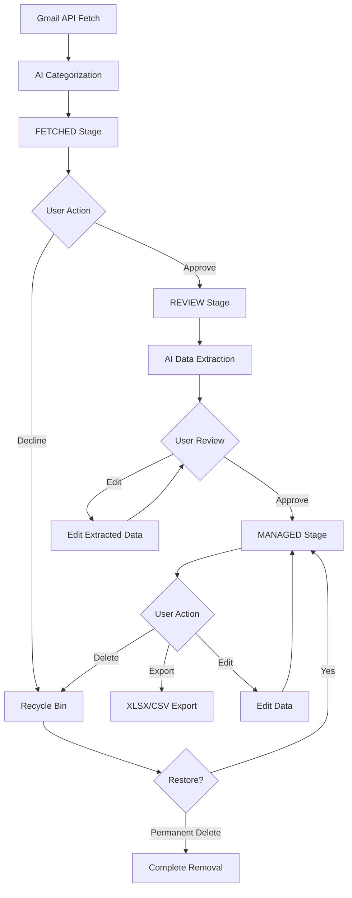

# Workflow Integration Guide

## 🔄 Complete Email Processing Workflow

This document details the integration of all components to create the seamless three-stage email workflow specified in the README.

## 📋 Workflow Overview



## 🔧 Component Integration Implementation

### 1. Enhanced Gmail Service Integration

**Update `lib/gmail.js`:**

```javascript
const aiService = require('./ai');
const db = require('./database');
const AuditService = require('./audit');

class GmailService {
  // ... existing methods ...

  async syncEmails() {
    try {
      console.log('🔄 Starting email sync...');
      const startTime = Date.now();
      
      // Initialize from stored tokens
      const isInitialized = await this.initializeFromStoredTokens();
      if (!isInitialized) {
        throw new Error('Gmail not connected or tokens expired');
      }

      // Fetch emails from Gmail
      const rawEmails = await this.fetchEmails(process.env.MAX_EMAILS_PER_SYNC || 50);
      console.log(`📧 Fetched ${rawEmails.length} raw emails`);

      if (rawEmails.length === 0) {
        await this.updateLastSync();
        return { count: 0, categorized: 0, errors: 0 };
      }

      // AI Categorization Integration
      const categorizedEmails = [];
      const errors = [];
      
      // Process emails in batches to respect AI API limits
      const batchSize = parseInt(process.env.AI_BATCH_SIZE) || 5;
      const batchDelay = parseInt(process.env.AI_BATCH_DELAY) || 1000;
      
      for (let i = 0; i < rawEmails.length; i += batchSize) {
        const batch = rawEmails.slice(i, i + batchSize);
        
        try {
          // Process batch with AI categorization
          const batchResults = await Promise.allSettled(
            batch.map(async (email) => {
              try {
                // AI Categorization
                const category = await aiService.categorizeEmail(
                  email.subject,
                  email.body,
                  email.attachments || []
                );
                
                return {
                  ...email,
                  category: category || 'other',
                  fromAddress: this.extractEmailAddress(email.from),
                  fromName: this.extractDisplayName(email.from),
                  toAddress: this.extractEmailAddress(email.to),
                  userId: 'single-user' // Single user system
                };
              } catch (error) {
                console.error(`❌ Failed to categorize email ${email.gmailId}:`, error);
                return {
                  ...email,
                  category: 'other', // Fallback category
                  fromAddress: this.extractEmailAddress(email.from),
                  fromName: this.extractDisplayName(email.from),
                  toAddress: this.extractEmailAddress(email.to),
                  userId: 'single-user'
                };
              }
            })
          );
          
          // Process results
          batchResults.forEach((result, index) => {
            if (result.status === 'fulfilled') {
              categorizedEmails.push(result.value);
            } else {
              errors.push({
                email: batch[index],
                error: result.reason
              });
            }
          });
          
          // Delay between batches to respect rate limits
          if (i + batchSize < rawEmails.length) {
            await new Promise(resolve => setTimeout(resolve, batchDelay));
          }
          
        } catch (error) {
          console.error(`❌ Batch processing failed:`, error);
          // Add batch to errors and continue
          batch.forEach(email => {
            errors.push({ email, error });
            // Add without categorization as fallback
            categorizedEmails.push({
              ...email,
              category: 'other',
              fromAddress: this.extractEmailAddress(email.from),
              fromName: this.extractDisplayName(email.from),
              toAddress: this.extractEmailAddress(email.to),
              userId: 'single-user'
            });
          });
        }
      }

      // Save categorized emails to database
      const savedEmails = await db.addMultipleFetchedEmails(categorizedEmails);
      console.log(`✅ Saved ${savedEmails.length} emails to database`);

      // Create notifications for successful sync
      if (savedEmails.length > 0) {
        await this.createSyncNotification(savedEmails);
      }

      // Update sync statistics
      await this.updateSyncStats(savedEmails.length, errors.length);
      
      // Audit log
      await AuditService.logSystemEvent('EMAIL_SYNC_COMPLETED', 
        `Synced ${savedEmails.length} emails with ${errors.length} errors in ${Date.now() - startTime}ms`
      );

      return {
        count: savedEmails.length,
        categorized: savedEmails.filter(e => e.category !== 'other').length,
        errors: errors.length,
        duration: Date.now() - startTime
      };

    } catch (error) {
      console.error('❌ Email sync failed:', error);
      
      // Audit log error
      await AuditService.logSystemEvent('EMAIL_SYNC_FAILED', 
        `Email sync failed: ${error.message}`
      );
      
      throw error;
    }
  }

  async createSyncNotification(savedEmails) {
    const categoryStats = savedEmails.reduce((acc, email) => {
      acc[email.category] = (acc[email.category] || 0) + 1;
      return acc;
    }, {});

    let message = `${savedEmails.length} new emails fetched`;
    if (categoryStats.customer_inquiry) {
      message += `, ${categoryStats.customer_inquiry} customer inquiries`;
    }
    if (categoryStats.invoice) {
      message += `, ${categoryStats.invoice} invoices`;
    }

    await db.createNotification({
      type: 'NEW_EMAIL_FETCHED',
      title: 'New Emails Synced',
      message,
      payload: {
        count: savedEmails.length,
        categoryStats,
        emailIds: savedEmails.map(e => e.id)
      },
      userId: 'single-user'
    });
  }

  async updateLastSync() {
    await db.updateSettings({
      lastSync: new Date().toISOString()
    });
  }

  async updateSyncStats(successful, failed) {
    const settings = await db.getSettings();
    const stats = settings.syncStats || { total: 0, successful: 0, failed: 0 };
    
    await db.updateSettings({
      syncStats: {
        total: stats.total + successful + failed,
        successful: stats.successful + successful,
        failed: stats.failed + failed,
        lastSync: new Date().toISOString()
      }
    });
  }

  extractEmailAddress(emailString) {
    if (!emailString) return '';
    const match = emailString.match(/<([^>]+)>/);
    return match ? match[1] : emailString.trim();
  }

  extractDisplayName(emailString) {
    if (!emailString) return null;
    const match = emailString.match(/^([^<]+)</);
    return match ? match[1].trim().replace(/"/g, '') : null;
  }

  // ... rest of existing methods ...
}

module.exports = new GmailService();
```

### 2. Enhanced Server Route Integration

**Update `server.js` with integrated workflow:**

```javascript
const AuditService = require('./lib/audit');
const NotificationService = require('./lib/notifications'); // New service

// Enhanced sync endpoint with real-time notifications
app.post('/api/emails/sync', async (req, res) => {
  try {
    const user = await gmailService.getConnectedUser();
    if (!user) {
      return res.status(401).json({ error: 'Not connected to Gmail' });
    }

    // Audit log
    await AuditService.log('EMAIL_SYNC_STARTED', 'Manual email sync initiated', req);

    const syncResult = await gmailService.syncEmails();
    
    // Broadcast real-time notification
    NotificationService.broadcast('sync_completed', {
      count: syncResult.count,
      categorized: syncResult.categorized,
      errors: syncResult.errors,
      duration: syncResult.duration
    });

    res.json({
      success: true,
      message: `Successfully synced ${syncResult.count} emails`,
      ...syncResult
    });

  } catch (error) {
    console.error('❌ Manual sync error:', error);
    await AuditService.logSecurityEvent('SYNC_FAILED', 'medium', req, error.message);
    res.status(500).json({ error: 'Failed to sync emails' });
  }
});

// Enhanced fetched email approval with AI processing
app.post('/api/emails/fetched/:id/approve', async (req, res) => {
  try {
    const { id } = req.params;
    
    // Move email to review stage
    const email = await db.approveFetchedEmail(id);
    if (!email) {
      return res.status(404).json({ error: 'Email not found or already processed' });
    }

    // Trigger AI data extraction in background
    setImmediate(async () => {
      try {
        await this.processEmailWithAI(email);
      } catch (error) {
        console.error(`❌ Background AI processing failed for email ${id}:`, error);
      }
    });

    // Audit log
    await AuditService.logEmailOperation('APPROVED', id, req);

    // Real-time notification
    NotificationService.broadcast('email_approved', { emailId: id, subject: email.subject });

    res.json({ 
      success: true, 
      message: 'Email approved and moved to review stage',
      email: { id: email.id, status: email.status }
    });

  } catch (error) {
    console.error('❌ Approve email error:', error);
    res.status(500).json({ error: 'Failed to approve email' });
  }
});

// AI processing helper method
async function processEmailWithAI(email) {
  try {
    console.log(`🤖 Processing email with AI: ${email.id}`);
    
    const aiResult = await aiService.processEmail({
      id: email.id,
      subject: email.subject,
      body: email.body,
      attachments: await db.getAttachmentsByEmailId(email.id)
    });

    if (aiResult.extractedData) {
      await db.createExtractedData({
        emailId: email.id,
        ...aiResult.extractedData,
        confidence: aiResult.confidence,
        processedAt: new Date().toISOString()
      });

      // Notify user that AI processing is complete
      await db.createNotification({
        type: 'EMAIL_PROCESSED',
        title: 'AI Processing Complete',
        message: `Data extracted from "${email.subject}"`,
        payload: { emailId: email.id, category: aiResult.category },
        userId: email.userId || 'single-user'
      });

      // Real-time notification
      NotificationService.broadcast('ai_processing_complete', {
        emailId: email.id,
        extractedData: aiResult.extractedData
      });
    }

  } catch (error) {
    console.error(`❌ AI processing failed for email ${email.id}:`, error);
    
    // Create error notification
    await db.createNotification({
      type: 'SYSTEM_ERROR',
      title: 'AI Processing Failed',
      message: `Failed to process "${email.subject}": ${error.message}`,
      payload: { emailId: email.id, error: error.message },
      userId: email.userId || 'single-user'
    });
  }
}

// Bulk operations with progress tracking
app.post('/api/emails/bulk-approve', async (req, res) => {
  try {
    const { emailIds } = req.body;
    
    if (!Array.isArray(emailIds) || emailIds.length === 0) {
      return res.status(400).json({ error: 'Email IDs array required' });
    }

    if (emailIds.length > 50) {
      return res.status(400).json({ error: 'Maximum 50 emails can be processed at once' });
    }

    // Audit log
    await AuditService.log('BULK_APPROVE_STARTED', `Bulk approving ${emailIds.length} emails`, req);

    // Process with progress tracking
    const results = await db.bulkApproveEmails(emailIds);
    const successCount = results.filter(r => r.success).length;

    // Background AI processing for successful approvals
    setImmediate(async () => {
      for (const result of results) {
        if (result.success) {
          try {
            await processEmailWithAI(result.result);
          } catch (error) {
            console.error(`❌ Bulk AI processing failed for ${result.id}:`, error);
          }
        }
      }
    });

    // Real-time progress update
    NotificationService.broadcast('bulk_operation_complete', {
      operation: 'approve',
      total: emailIds.length,
      successful: successCount,
      failed: emailIds.length - successCount
    });

    res.json({
      success: true,
      message: `${successCount} of ${emailIds.length} emails approved successfully`,
      results
    });

  } catch (error) {
    console.error('❌ Bulk approve error:', error);
    res.status(500).json({ error: 'Bulk approve operation failed' });
  }
});

// Enhanced statistics with real-time data
app.get('/api/stats', async (req, res) => {
  try {
    const stats = await db.getEmailStats('single-user');
    const settings = await db.getSettings();
    const notifications = await db.getNotifications('single-user', true); // Unread only

    res.json({
      ...stats,
      lastSync: settings.lastSync,
      autoSync: settings.autoSync,
      syncStats: settings.syncStats || {},
      unreadNotifications: notifications.length,
      systemHealth: {
        uptime: process.uptime(),
        memoryUsage: process.memoryUsage(),
        nodeVersion: process.version
      }
    });

  } catch (error) {
    console.error('❌ Stats error:', error);
    res.status(500).json({ error: 'Failed to get stats' });
  }
});
```

### 3. Real-Time Notification Service

**Create `lib/notifications.js`:**

```javascript
class NotificationService {
  constructor() {
    this.clients = new Map();
    this.setupCleanup();
  }

  // Server-Sent Events endpoint
  subscribe(req, res) {
    const clientId = this.generateClientId();
    
    res.writeHead(200, {
      'Content-Type': 'text/event-stream',
      'Cache-Control': 'no-cache',
      'Connection': 'keep-alive',
      'Access-Control-Allow-Origin': '*',
      'Access-Control-Allow-Headers': 'Cache-Control'
    });

    // Send initial connection confirmation
    res.write(`data: ${JSON.stringify({ type: 'connected', clientId })}\n\n`);

    // Store client connection
    this.clients.set(clientId, {
      id: clientId,
      response: res,
      userId: req.session?.userId || 'single-user',
      connectedAt: new Date()
    });

    console.log(`📡 Client ${clientId} connected for real-time notifications`);

    // Handle client disconnect
    req.on('close', () => {
      this.clients.delete(clientId);
      console.log(`📡 Client ${clientId} disconnected`);
    });

    req.on('error', () => {
      this.clients.delete(clientId);
    });
  }

  // Broadcast to all connected clients
  broadcast(eventType, data) {
    const message = JSON.stringify({
      type: eventType,
      data,
      timestamp: new Date().toISOString()
    });

    let sentCount = 0;
    const disconnectedClients = [];

    this.clients.forEach((client, clientId) => {
      try {
        client.response.write(`event: ${eventType}\n`);
        client.response.write(`data: ${message}\n\n`);
        sentCount++;
      } catch (error) {
        console.error(`❌ Failed to send to client ${clientId}:`, error);
        disconnectedClients.push(clientId);
      }
    });

    // Clean up disconnected clients
    disconnectedClients.forEach(clientId => {
      this.clients.delete(clientId);
    });

    if (sentCount > 0) {
      console.log(`📡 Broadcasted ${eventType} to ${sentCount} clients`);
    }
  }

  // Send to specific user
  sendToUser(userId, eventType, data) {
    const message = JSON.stringify({
      type: eventType,
      data,
      timestamp: new Date().toISOString()
    });

    let sentCount = 0;
    this.clients.forEach((client) => {
      if (client.userId === userId) {
        try {
          client.response.write(`event: ${eventType}\n`);
          client.response.write(`data: ${message}\n\n`);
          sentCount++;
        } catch (error) {
          console.error(`❌ Failed to send to user ${userId}:`, error);
        }
      }
    });

    console.log(`📡 Sent ${eventType} to ${sentCount} clients for user ${userId}`);
  }

  generateClientId() {
    return `client_${Date.now()}_${Math.random().toString(36).substr(2, 9)}`;
  }

  setupCleanup() {
    // Clean up stale connections every 5 minutes
    setInterval(() => {
      const staleTimeout = 30 * 60 * 1000; // 30 minutes
      const now = new Date();
      const staleClients = [];

      this.clients.forEach((client, clientId) => {
        if (now - client.connectedAt > staleTimeout) {
          staleClients.push(clientId);
        }
      });

      staleClients.forEach(clientId => {
        console.log(`🧹 Removing stale client ${clientId}`);
        const client = this.clients.get(clientId);
        if (client) {
          try {
            client.response.end();
          } catch (error) {
            // Ignore errors when closing stale connections
          }
        }
        this.clients.delete(clientId);
      });

      if (staleClients.length > 0) {
        console.log(`🧹 Cleaned up ${staleClients.length} stale connections`);
      }
    }, 5 * 60 * 1000);
  }

  getStats() {
    return {
      connectedClients: this.clients.size,
      clients: Array.from(this.clients.values()).map(client => ({
        id: client.id,
        userId: client.userId,
        connectedAt: client.connectedAt
      }))
    };
  }
}

module.exports = new NotificationService();
```

### 4. Enhanced Cron Job Integration

**Update automatic sync in `server.js`:**

```javascript
const cron = require('node-cron');
const NotificationService = require('./lib/notifications');

// Enhanced auto sync with better error handling and notifications
cron.schedule('*/5 * * * *', async () => {
  try {
    const settings = await db.getSettings();
    if (!settings.autoSync) {
      return;
    }
    
    const user = await gmailService.getConnectedUser();
    if (!user) {
      return;
    }
    
    console.log('🔄 Running scheduled auto sync...');
    
    const syncResult = await gmailService.syncEmails();
    
    if (syncResult.count > 0) {
      console.log(`✅ Auto sync completed: ${syncResult.count} new emails`);
      
      // Broadcast to connected clients
      NotificationService.broadcast('auto_sync_complete', {
        count: syncResult.count,
        categorized: syncResult.categorized,
        timestamp: new Date().toISOString()
      });
    }
    
  } catch (error) {
    console.error('❌ Auto sync error:', error);
    
    // Create system notification for sync failures
    await db.createNotification({
      type: 'SYSTEM_ERROR',
      title: 'Auto Sync Failed',
      message: `Automatic email sync failed: ${error.message}`,
      payload: { error: error.message, timestamp: new Date().toISOString() },
      userId: 'single-user'
    });
    
    // Notify connected clients
    NotificationService.broadcast('sync_error', {
      error: error.message,
      timestamp: new Date().toISOString()
    });
  }
});

// Backup schedule
cron.schedule('0 2 * * *', async () => {
  try {
    if (process.env.ENABLE_AUTO_BACKUP === 'true') {
      console.log('💾 Running scheduled backup...');
      
      const backup = await db.createBackup();
      const fs = require('fs');
      const path = require('path');
      
      // Ensure backup directory exists
      const backupDir = process.env.BACKUP_DIR || './backups';
      if (!fs.existsSync(backupDir)) {
        fs.mkdirSync(backupDir, { recursive: true });
      }
      
      // Save backup
      const filename = `backup-${new Date().toISOString().split('T')[0]}.json`;
      const filepath = path.join(backupDir, filename);
      fs.writeFileSync(filepath, JSON.stringify(backup, null, 2));
      
      console.log(`✅ Backup created: ${filename}`);
      
      // Clean old backups
      const retentionDays = parseInt(process.env.BACKUP_RETENTION_DAYS) || 30;
      const cutoffDate = new Date();
      cutoffDate.setDate(cutoffDate.getDate() - retentionDays);
      
      const files = fs.readdirSync(backupDir);
      files.forEach(file => {
        if (file.startsWith('backup-') && file.endsWith('.json')) {
          const filePath = path.join(backupDir, file);
          const stats = fs.statSync(filePath);
          if (stats.mtime < cutoffDate) {
            fs.unlinkSync(filePath);
            console.log(`🗑️ Deleted old backup: ${file}`);
          }
        }
      });
      
      // Audit log
      await AuditService.logSystemEvent('BACKUP_CREATED', `Automatic backup created: ${filename}`);
      
    }
  } catch (error) {
    console.error('❌ Backup error:', error);
    await AuditService.logSystemEvent('BACKUP_FAILED', `Automatic backup failed: ${error.message}`);
  }
});

// Add SSE endpoint for real-time notifications
app.get('/api/notifications/stream', (req, res) => {
  NotificationService.subscribe(req, res);
});

// Notification management endpoints
app.get('/api/notifications', async (req, res) => {
  try {
    const { unread } = req.query;
    const notifications = await db.getNotifications('single-user', unread === 'true');
    res.json(notifications);
  } catch (error) {
    res.status(500).json({ error: 'Failed to get notifications' });
  }
});

app.post('/api/notifications/:id/read', async (req, res) => {
  try {
    const { id } = req.params;
    const notification = await db.markNotificationAsRead(id);
    
    if (!notification) {
      return res.status(404).json({ error: 'Notification not found' });
    }
    
    // Broadcast to update UI
    NotificationService.broadcast('notification_read', { notificationId: id });
    
    res.json({ success: true, notification });
  } catch (error) {
    res.status(500).json({ error: 'Failed to mark notification as read' });
  }
});

app.post('/api/notifications/mark-all-read', async (req, res) => {
  try {
    const updated = await db.markAllNotificationsAsRead('single-user');
    
    if (updated) {
      NotificationService.broadcast('all_notifications_read', { timestamp: new Date().toISOString() });
    }
    
    res.json({ success: true, updated });
  } catch (error) {
    res.status(500).json({ error: 'Failed to mark all notifications as read' });
  }
});
```

### 5. Frontend Workflow Integration

**Create `public/js/workflow.js`:**

```javascript
class WorkflowManager {
  constructor() {
    this.currentStage = 'fetched';
    this.eventSource = null;
    this.init();
  }

  async init() {
    this.setupRealTimeUpdates();
    this.bindWorkflowEvents();
    await this.loadCurrentStage();
  }

  setupRealTimeUpdates() {
    // Establish Server-Sent Events connection
    this.eventSource = new EventSource('/api/notifications/stream');
    
    this.eventSource.onopen = () => {
      console.log('📡 Real-time connection established');
    };
    
    this.eventSource.onerror = (error) => {
      console.error('📡 Real-time connection error:', error);
      // Attempt to reconnect after 5 seconds
      setTimeout(() => {
        this.setupRealTimeUpdates();
      }, 5000);
    };
    
    // Handle different event types
    this.eventSource.addEventListener('sync_completed', (event) => {
      const data = JSON.parse(event.data);
      this.handleSyncComplete(data);
    });
    
    this.eventSource.addEventListener('email_approved', (event) => {
      const data = JSON.parse(event.data);
      this.handleEmailApproved(data);
    });
    
    this.eventSource.addEventListener('ai_processing_complete', (event) => {
      const data = JSON.parse(event.data);
      this.handleAIProcessingComplete(data);
    });
    
    this.eventSource.addEventListener('bulk_operation_complete', (event) => {
      const data = JSON.parse(event.data);
      this.handleBulkOperationComplete(data);
    });
  }

  async loadCurrentStage() {
    try {
      const response = await fetch('/api/stats');
      const stats = await response.json();
      
      // Update stage counts
      this.updateStageCounts(stats);
      
      // Load appropriate data table
      await this.loadStageData(this.currentStage);
      
    } catch (error) {
      console.error('❌ Failed to load workflow stage:', error);
    }
  }

  async loadStageData(stage) {
    let endpoint;
    switch (stage) {
      case 'fetched':
        endpoint = '/api/emails/fetched';
        break;
      case 'review':
        endpoint = '/api/emails/review';
        break;
      case 'managed':
        endpoint = '/api/emails/processed';
        break;
      default:
        return;
    }
    
    try {
      const response = await fetch(endpoint);
      const emails = await response.json();
      
      this.renderStageTable(stage, emails);
      
    } catch (error) {
      console.error(`❌ Failed to load ${stage} emails:`, error);
    }
  }

  renderStageTable(stage, emails) {
    const container = document.getElementById(`${stage}EmailsTable`);
    if (!container) return;
    
    // Create or update data table
    const tableConfig = {
      data: emails,
      columns: this.getStageColumns(stage),
      sortable: true,
      filterable: true,
      paginated: true,
      pageSize: 50,
      selectable: stage !== 'managed', // Enable bulk selection for fetched/review
      bulkActions: this.getStageBulkActions(stage)
    };
    
    // Use DataTable component
    const table = window.aems?.tables?.create(`${stage}EmailsTable`, tableConfig) || 
                  new DataTable(`${stage}EmailsTable`, tableConfig);
    
    // Bind stage-specific actions
    this.bindStageActions(stage, table);
  }

  getStageColumns(stage) {
    const baseColumns = [
      { key: 'date', title: 'Date', sortable: true, formatter: this.formatDate },
      { key: 'subject', title: 'Subject', sortable: true },
      { key: 'fromAddress', title: 'From', sortable: true },
      { key: 'category', title: 'Category', sortable: true, formatter: this.formatCategory }
    ];
    
    switch (stage) {
      case 'fetched':
        return [
          ...baseColumns,
          { key: 'actions', title: 'Actions', formatter: this.formatFetchedActions }
        ];
      
      case 'review':
        return [
          ...baseColumns,
          { key: 'extractedData', title: 'Extracted Data', formatter: this.formatExtractedData },
          { key: 'actions', title: 'Actions', formatter: this.formatReviewActions }
        ];
      
      case 'managed':
        return [
          ...baseColumns,
          { key: 'managedAt', title: 'Processed', formatter: this.formatDate },
          { key: 'actions', title: 'Actions', formatter: this.formatManagedActions }
        ];
      
      default:
        return baseColumns;
    }
  }

  getStageBulkActions(stage) {
    switch (stage) {
      case 'fetched':
        return [
          { label: 'Approve Selected', action: 'bulk-approve', class: 'btn-primary' },
          { label: 'Decline Selected', action: 'bulk-decline', class: 'btn-secondary' }
        ];
      
      case 'review':
        return [
          { label: 'Process Selected', action: 'bulk-process', class: 'btn-primary' }
        ];
      
      default:
        return [];
    }
  }

  bindStageActions(stage, table) {
    const container = table.container;
    
    // Individual actions
    container.addEventListener('click', (e) => {
      const action = e.target.dataset.action;
      const emailId = e.target.dataset.emailId;
      
      switch (action) {
        case 'approve':
          this.approveEmail(emailId);
          break;
        case 'decline':
          this.declineEmail(emailId);
          break;
        case 'process':
          this.processEmail(emailId);
          break;
        case 'edit':
          this.editEmail(emailId);
          break;
        case 'view':
          this.viewEmail(emailId);
          break;
      }
    });
    
    // Bulk actions
    container.addEventListener('click', (e) => {
      if (e.target.dataset.bulkAction) {
        const action = e.target.dataset.bulkAction;
        const selectedIds = table.getSelectedRows();
        
        if (selectedIds.length === 0) {
          window.aems?.notifications?.show('Please select emails first', 'warning');
          return;
        }
        
        switch (action) {
          case 'bulk-approve':
            this.bulkApproveEmails(selectedIds);
            break;
          case 'bulk-decline':
            this.bulkDeclineEmails(selectedIds);
            break;
          case 'bulk-process':
            this.bulkProcessEmails(selectedIds);
            break;
        }
      }
    });
  }

  // Individual email actions
  async approveEmail(emailId) {
    try {
      const response = await window.securityManager.secureRequest(
        `/api/emails/fetched/${emailId}/approve`, 
        { method: 'POST' }
      );
      
      if (response.ok) {
        window.aems?.notifications?.show('Email approved successfully', 'success');
        await this.loadCurrentStage(); // Refresh current view
      } else {
        throw new Error('Failed to approve email');
      }
    } catch (error) {
      console.error('❌ Failed to approve email:', error);
      window.aems?.notifications?.show('Failed to approve email', 'error');
    }
  }

  async bulkApproveEmails(emailIds) {
    try {
      // Show progress indicator
      this.showBulkProgress('Approving emails...', emailIds.length);
      
      const response = await window.securityManager.secureRequest('/api/emails/bulk-approve', {
        method: 'POST',
        body: JSON.stringify({ emailIds })
      });
      
      const result = await response.json();
      
      if (response.ok) {
        window.aems?.notifications?.show(
          `${result.results.filter(r => r.success).length} emails approved successfully`, 
          'success'
        );
        await this.loadCurrentStage();
      } else {
        throw new Error(result.error || 'Bulk approve failed');
      }
      
    } catch (error) {
      console.error('❌ Bulk approve failed:', error);
      window.aems?.notifications?.show('Bulk approve operation failed', 'error');
    } finally {
      this.hideBulkProgress();
    }
  }

  // Event handlers for real-time updates
  handleSyncComplete(data) {
    window.aems?.notifications?.show(
      `Sync completed: ${data.data.count} new emails`, 
      'success'
    );
    
    // Update stats and current view
    this.loadCurrentStage();
  }

  handleEmailApproved(data) {
    // Remove from fetched table if currently viewing
    if (this.currentStage === 'fetched') {
      const table = window.aems?.tables?.get('fetchedEmailsTable');
      if (table) {
        table.removeRow(data.data.emailId);
      }
    }
    
    // Update stage counts
    this.updateStageCounters();
  }

  handleAIProcessingComplete(data) {
    window.aems?.notifications?.show(
      'AI processing completed for email', 
      'info'
    );
    
    // If viewing review stage, refresh to show extracted data
    if (this.currentStage === 'review') {
      this.loadCurrentStage();
    }
  }

  handleBulkOperationComplete(data) {
    const { operation, total, successful, failed } = data.data;
    
    window.aems?.notifications?.show(
      `Bulk ${operation}: ${successful}/${total} successful`, 
      successful === total ? 'success' : 'warning'
    );
    
    this.loadCurrentStage();
  }

  // Utility methods
  formatDate(date) {
    return new Date(date).toLocaleString();
  }

  formatCategory(category) {
    const categoryMap = {
      'customer_inquiry': { label: 'Customer Inquiry', class: 'badge-primary' },
      'invoice': { label: 'Invoice', class: 'badge-success' },
      'other': { label: 'Other', class: 'badge-secondary' }
    };
    
    const cat = categoryMap[category] || categoryMap.other;
    return `<span class="badge ${cat.class}">${cat.label}</span>`;
  }

  formatFetchedActions(email) {
    return `
      <div class="btn-group">
        <button class="btn btn-sm btn-primary" data-action="approve" data-email-id="${email.id}">
          Approve
        </button>
        <button class="btn btn-sm btn-secondary" data-action="decline" data-email-id="${email.id}">
          Decline
        </button>
        <button class="btn btn-sm btn-outline" data-action="view" data-email-id="${email.id}">
          View
        </button>
      </div>
    `;
  }

  formatReviewActions(email) {
    return `
      <div class="btn-group">
        <button class="btn btn-sm btn-primary" data-action="process" data-email-id="${email.id}">
          Process
        </button>
        <button class="btn btn-sm btn-outline" data-action="edit" data-email-id="${email.id}">
          Edit
        </button>
      </div>
    `;
  }

  formatManagedActions(email) {
    return `
      <div class="btn-group">
        <button class="btn btn-sm btn-outline" data-action="edit" data-email-id="${email.id}">
          Edit
        </button>
        <button class="btn btn-sm btn-secondary" data-action="delete" data-email-id="${email.id}">
          Delete
        </button>
      </div>
    `;
  }

  showBulkProgress(message, total) {
    // Implementation for progress indicator
  }

  hideBulkProgress() {
    // Implementation for hiding progress
  }

  updateStageCounters() {
    // Update stage count badges in UI
  }

  updateStageCounts(stats) {
    document.getElementById('fetchedCount').textContent = stats.fetched || 0;
    document.getElementById('reviewCount').textContent = stats.review || 0;
    document.getElementById('processedCount').textContent = stats.managed || 0;
  }
}

// Initialize workflow manager
document.addEventListener('DOMContentLoaded', () => {
  window.workflowManager = new WorkflowManager();
});
```

## ✅ Integration Checklist

### Phase 1 Integration
- [ ] **Gmail Service Enhancement** - AI categorization during sync
- [ ] **Database Method Alignment** - All missing methods implemented
- [ ] **Basic Server Routes** - Enhanced with workflow logic
- [ ] **Real-time Infrastructure** - SSE setup for live updates

### Phase 2 Integration  
- [ ] **Workflow State Management** - Proper stage transitions
- [ ] **AI Processing Pipeline** - Background processing with notifications
- [ ] **Bulk Operations** - Frontend and backend integration
- [ ] **Notification System** - Real-time updates and persistence

### Phase 3 Integration
- [ ] **Advanced Features** - Import/export with workflow
- [ ] **Performance Optimization** - Caching and rate limiting
- [ ] **Error Handling** - Comprehensive error management
- [ ] **Monitoring Integration** - Health checks and metrics

This comprehensive workflow integration ensures all components work together seamlessly to provide the three-stage email processing system specified in the README.